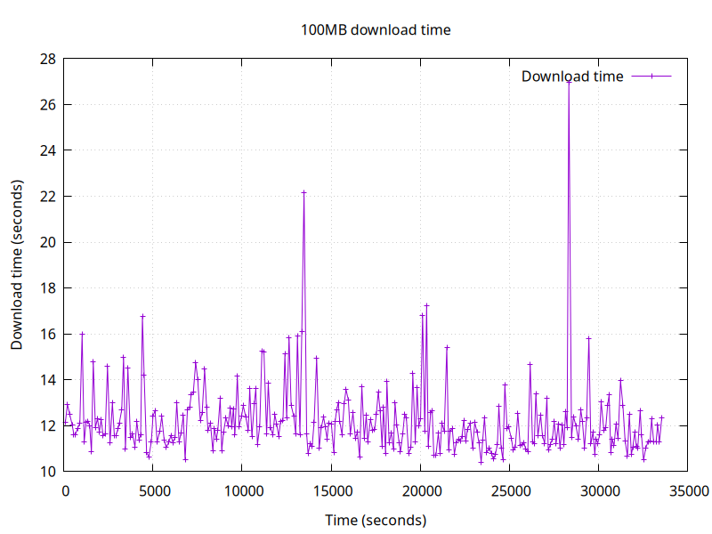

# A network health monitor

A very raw netwprk monitor just for my needs.

'''sh
$ ./conmon.sh
Next curl in 80 seconds
Next ping in 10 seconds
Next ping in 21 seconds
Next ping in 16 seconds
Next ping in 28 seconds
Next curl in 81 seconds
Next ping in 28 seconds
Next ping in 25 seconds
Next ping in 29 seconds
Next curl in 74 seconds
Next ping in 11 seconds
Next ping in 21 seconds
Next ping in 23 seconds
Next ping in 27 seconds
Next curl in 120 seconds
Next ping in 10 seconds
Next ping in 18 seconds
Next ping in 17 seconds
<ctrl-c>
$ ./plot_ping_times.gp
$ ./plot_curl_times.gp
$ eog ping_log.png
$ eog curl_log.png
```




No more, no less.
